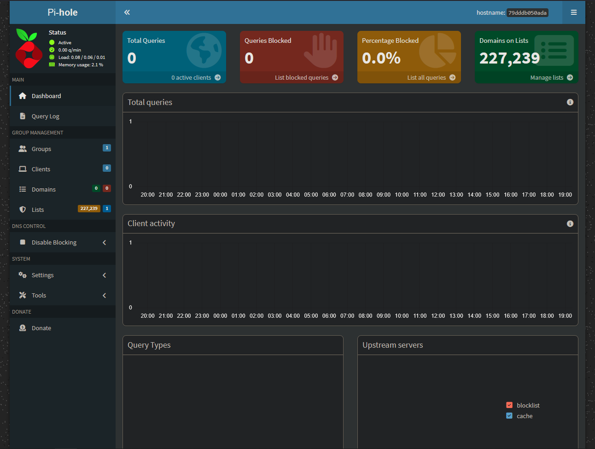

# Tools

The tools in this stack will include:
    - Docker
    - Cockpit
    - Tailscale
    - Pi-hole
    - Portainer
    - Glance


As well as potentially:
    - Nginx Proxy Manager

## Setting up Docker

Docker was installed on my system when I initially setup the Ubuntu Server OS, but during my Jellyfin installation, I realized that I had installed a depricated version of docker compose. I updated to the current version via 

```
mkdir -p ~/.docker/cli-plugins/
curl -SL https://github.com/docker/compose/releases/download/v2.24.6/docker-compose-linux-x86_64 -o ~/.docker/cli-plugins/docker-compose
chmod +x ~/.docker/cli-plugins/docker-compose
```

### oh snap...

When I was setting up Seafile, I ran into an unexpected issue with my Docker. ```error while creating mount source path '/opt/seafile-mysql/db': mkdir /opt/seafile-mysql: read-only file system``` It turned out that my Docker was installed incorrectly and I was using a snap version. After running ```sudo docker info```, I found out that this version was known for being buggy. To fix it, I found a guide in the [Docker Docs](https://docs.docker.com/engine/install/ubuntu). Here is a quick run down:

```
# Uninstall all previous or conflicting versions of Docker
for pkg in docker.io docker-doc docker-compose docker-compose-v2 podman-docker containerd runc; do sudo apt-get remove $pkg; done

# Add Docker's official GPG key:
sudo apt-get update
sudo apt-get install ca-certificates curl
sudo install -m 0755 -d /etc/apt/keyrings
sudo curl -fsSL https://download.docker.com/linux/ubuntu/gpg -o /etc/apt/keyrings/docker.asc
sudo chmod a+r /etc/apt/keyrings/docker.asc

# Add the repository to Apt sources:
echo \
  "deb [arch=$(dpkg --print-architecture) signed-by=/etc/apt/keyrings/docker.asc] https://download.docker.com/linux/ubuntu \
  $(. /etc/os-release && echo "${UBUNTU_CODENAME:-$VERSION_CODENAME}") stable" | \
  sudo tee /etc/apt/sources.list.d/docker.list > /dev/null
sudo apt-get update

# Install the latest version of Docker
sudo apt-get install docker-ce docker-ce-cli containerd.io docker-buildx-plugin docker-compose-plugin
```

I then wrote up a small bash script that allowed me to start up all my containers at once. Docker is now working better than ever!

### ⚠️ Important 
A few small things to note, make sure that the docker daemon service is running. You can check it's status with ```sudo systemctl status docker``` and enable it with ```sudo systemctl enable docker```

## Setting up Cockpit

Downloaded Cockpit via ```sudo apt install cockpit``` and started the service via ```sudo systemctl enable --now cockpit.socket```

No container needed for Cockpit.

## Setting up Tailscale
Originally, I had installed Tailscale via snap, but ran into issues where the Tailscale command (and other snap executible commands) couldn't be located in the shell's path. This is because I didn't have snap configured correctly, so instead of fixing it I decided it best to install Tailscale via their official container image.

```
# Remove snap version
sudo snap remove tailscale

# Install from official repo
curl -fsSL https://tailscale.com/install.sh | sh

# Enable and start
sudo tailscale up
```

After that it was as simple as logging in and and setting up my network.

## Setting up Portainer
I followed [this install guide](https://docs.portainer.io/start/install-ce) to setup Portainer. Configured the volume and then installed via the following command: 

```docker run -d -p 8000:8000 -p 9443:9443 --name portainer --restart=always -v /var/run/docker.sock:/var/run/docker.sock -v portainer_data:/data portainer/portainer-ce:lts```

Ran into no issues and reached via https://localhost:9443

## Setting up Pihole

I started off by navigating to the [official docker repo](https://github.com/pi-hole/docker-pi-hole) where I found a sample docker compose file there. After some edits, I ended up with this:

```
# More info at https://github.com/pi-hole/docker-pi-hole/ and https://docs.pi-hole.net/
services:
  pihole:
    container_name: pihole
    image: pihole/pihole:latest
    ports:
      # DNS Ports
      - "53:53/tcp"
      - "53:53/udp"
      # Default HTTP Port
      - "80:80/tcp"
      # Default HTTPs Port. FTL will generate a self-signed certificate
      - "443:443/tcp"
      # Uncomment the line below if you are using Pi-hole as your DHCP server
      #- "67:67/udp"
      # Uncomment the line below if you are using Pi-hole as your NTP server
      #- "123:123/udp"
    environment:
      # Set the appropriate timezone for your location (https://en.wikipedia.org/wiki/List_of_tz_database_time_zones), e.g:
      TZ: 'America/Edmonton'
      # Set a password to access the web interface. Not setting one will result in a random password being assigned
      FTLCONF_webserver_api_password: 'REDACTED'
      # If using Docker's default `bridge` network setting the dns listening mode should be set to 'all'
      FTLCONF_dns_listeningMode: 'all'
    # Volumes store your data between container upgrades
    volumes:
      # For persisting Pi-hole's databases and common configuration file
      - './~/server/etc-pihole:/etc/pihole'
      # Uncomment the below if you have custom dnsmasq config files that you want to persist. Not needed for most starting fresh with Pi-hole v6. If you're upgrading from v5 you and have used this directory before, you should keep it enabled for the first v6 container start to allow for a complete migration. It can be removed afterwards. Needs environment variable FTLCONF_misc_etc_dnsmasq_d: 'true'
      #- './etc-dnsmasq.d:/etc/dnsmasq.d'
    # cap_add:
      # See https://github.com/pi-hole/docker-pi-hole#note-on-capabilities
      # Required if you are using Pi-hole as your DHCP server, else not needed
      # - NET_ADMIN
      # Required if you are using Pi-hole as your NTP client to be able to set the host's system time
      # - SYS_TIME
      # Optional, if Pi-hole should get some more processing time
      # - SYS_NICE
    restart: unless-stopped
```

The entire file has a lot of bloat that I didn't end up actually needing. The most important part was ensuring that the DNS ports were configured properly for both TCP and UDP, HTTP port was = 80 so we can access the webclient and that the ```FTLCONF_webserver_api_password: " is set correct. It is also important to mention that the volume for the config file needs to be mounted correctly as the container will need proper access to that file. 

When I ran the container I got a message saying "failed to bind host port". Apparently Linux has a DNS stub listener enabled by default that uses port 53 so I had to disable that next. The first step was to disable the DNS Stub Listener by changing its' value in the config file. 

```
# Disable DNS Stub Listener
sudo nano /etc/systemd/resolved.conf
```

You are going to want to look for a line that may be commented out. It will say ```#DNSStubListener=Yes```. Just uncomment that and change it to "No". Moving on, you are going to want to remove a different config file and make a link to it as follows.

```
# Remove existing resolv config
sudo rm /etc/resolv.conf

# Make the symbolic link to a different location
sudo ln -s /run/systemd/resolve/resolv.conf  /etc/resolv.conf

# Restart the services
sudo systemctl restart systemd-resolved
sudo systemctl daemon-reload
```

Pihole should now run properly!



### Unfortunate Limitations

Unfortunately, after getting to this point in the setup, I realized that my router would not allow me to set Pihole as my default DNS for the entire network. Ideally, I would have configured it so that all devices that connect to my Wi-Fi automatically use Pihole without need for manual setup. Since this wasn't a possibility for me anymore, that left me with two main paths: either set Pihole as my DHCP server as well or buy a new router and run double NAT. Unfortunately, the bastards at Rogers also made it impossible to use Pihole as a DHCP server as well meaning that I was only left with the latter choice. In the end, I actually chose none of these paths and decided that I would setup Pihole on a per device basis and just leave it at that. It was the cheapest and easiest path. Especially with the reasoning I had for using Pihole, it didn't make sense to go all in on setting up a second router. Perhaps I can leave it for a future project. 

## Setting up Glance

Installing glance was relativlely simple due to their very detailed [documentation](https://github.com/glanceapp/glance/tree/main?tab=readme-ov-file#installation). I started off by creating a new directory as well as the template files within by running: 

```
mkdir glance && cd glance && curl -sL https://github.com/glanceapp/docker-compose-template/archive/refs/heads/main.tar.gz | tar -xzf - --strip-components 2
```

After that, I had to make a small change to the docker compose file because the default port 8080 that Glance uses is already being used by my File Browser container. Here is my docker compose:

```
services:
  glance:
    container_name: glance
    image: glanceapp/glance
    restart: unless-stopped
    volumes:
      - ./config:/app/config
      - ./assets:/app/assets
      # Optionally, also mount docker socket if you want to use the docker containers widget
      # - /var/run/docker.sock:/var/run/docker.sock:ro
    ports:
      - 8081:8080
    env_file: .env
```

Because I am using portainer, I felt that there wasn't a need to mount the docker socket to see container status. I then proceeded to tweak the config file "home.yml". Here is a list of the things I did:

- Replaced the twitch tab with a services tab that monitors my applications and has direct links to all my services
- Changed the weather to Calgary instead of London
- Added my repositories in the bottom right
- Added more Reddit tabs, Youtube creators, and RSS URLs to my RSS feed

Tweaking the config file was super simple as it is just a yml file and all the documentation for customizing your dashboard is extensive. You can find it all [here](https://github.com/glanceapp/glance/blob/main/docs/configuration.md#configuring-glance).

The final thing I wanted to configure was for my newly configured Glance dashboard to be the default page when opening up a new page on Firefox. To do this, I downloaded an extension called [New Tab Override](https://addons.mozilla.org/en-US/firefox/addon/new-tab-override/) and added my Glance URL to it. That's it!


Shortly after messing around with my new glance dashboard, I found out about community widgets. Although some of the tutorials for these were obscure, I added the Google Calendar widget and the NHL widget. Some were easier to setup than others, and it was a good opportunity to mess around with APIs and add some more custom flavour to my personal productivity dashboard.

## NGINX

As my server began to accumulate more users, I realized that I needed a better way to manage access to the various services running on it. I had unfortunately hit the user limit on Tailscale and could no longer send infinite invites out to friends and family. It was at this point that I decided that it was time to set up Jellyfin and Immich to be publicly accessible via the web and the first step was to set up a reverse proxy using NGINX. 

The first step was to install NGINX via ```sudo apt install nginx```. I chose to run NGINX directly on the host machine instead of in a container because I wanted it to be lightweight and have minimal overhead. After installation, I created a new server block configuration file for each service I wanted to expose. Here is an example configuration for Jellyfin:

```
server {
    listen 80;
    server_name jellyfin.mydomain.com;

    location / {
        proxy_pass http://localhost:8096;
        proxy_set_header Host $host;
        proxy_set_header X-Real-IP $remote_addr;
        proxy_set_header X-Forwarded-For $proxy_add_x_forwarded_for;
        proxy_set_header X-Forwarded-Proto $scheme;
    }
}
```

I repeated this process for Immich and any other services I wanted to expose. After creating the configuration files, I enabled them by creating symbolic links in the `/etc/nginx/sites-enabled/` directory. Finally, I tested the NGINX configuration for syntax errors using `sudo nginx -t` and reloaded NGINX to apply the changes with `sudo systemctl reload nginx`.

This was just the first step in making my services publicly accessible. The next step involved setting up SSL certificates using Let's Encrypt to ensure secure connections. I used Certbot to automate the process of obtaining and renewing SSL certificates. Overall, setting up NGINX as a reverse proxy has greatly improved the accessibility and security of my home lab services.

After setting up NGINX, I decided to further enhance the security of my server by turning on the UFW on Linux. I allowed only necessary ports such as 22 for SSH, 80 for HTTP, and 443 for HTTPS. This ensured that only essential traffic could reach my server, reducing the attack surface. Unknowingly though, I had blocked my containers' ability to communicate with each other, meaning that my Jellyfin addon stack was no longer working and I could no longer download content. 

### The Fix

The problem was stemming from the UFW on Linux that I enabled on configuration of the Nginx reverse proxy. If UFW is active and blocking all incoming connections, the containers’ web UIs are still reachable from LAN, **but Sonarr/Radarr can’t talk to qBittorrent internally**. This happens because Docker hooks its own iptables chains and bypasses UFW except on forwarded/internal traffic. 

This is exactly what docker container traffic is which is why despite the network being configured correctly, traffic still isn't able to travel between containers. This means that I had to find a way to treat docker traffic the same way we treat local traffic. 

I managed to come up with a fix by creating a new external docker network called media-net and attaching the services gluetun, prowlarr, sonarr and radarr to it while leaving qbittorrent and flaresolverr behind gluetun. Instead of using the server IPv4 address now for the cross container communication, I can just use the service name instead. In the case of qBittorrent and FlareSolverr, I can just use gluetun:< port > since they are still behind the service. Here is how I defined the new network:

``` 
# Docker compose network definition
networks:
  media-net:
    external: true

# Create the network command
docker network create media-net
```
